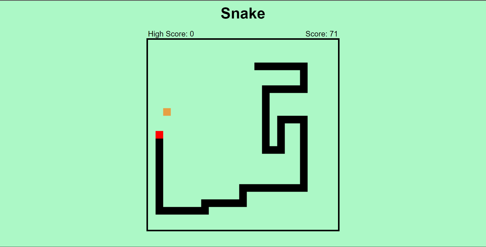

# Snake Game with vanilla TypeScript

This is a simple snake game made with only **TypeScript** and **Vite** as a build tool.
>[try it out](https://panditraghav.github.io/snake-game)




## How to build

### Step 1:- 
Clone the repository 
```
git clone https://github.com/panditraghav/snake-game.git
```
### Step 2:- 
install dependencies
```
npm install
```
### Step 3:- 
```
npm run dev
```
> or
>```
>npm run build
>```